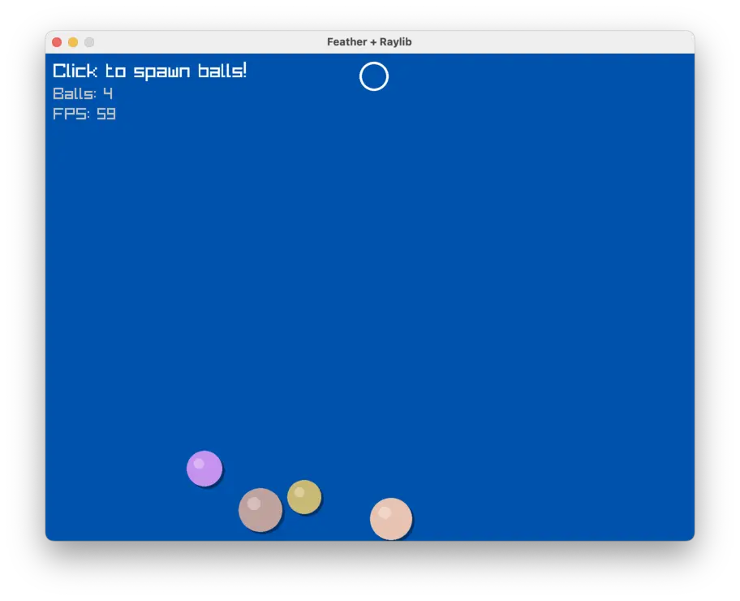

# Feather + Raylib Example

A bouncing balls demo showing how to embed Feather as a scripting language in a Raylib game.

<p align="center">
  
</p>

## Overview

This example demonstrates:
- Embedding libfeather in a C application
- Using TCL scripts for rendering logic
- Game state management in C with TCL for draw commands
- Real-time input handling

## Prerequisites

- libfeather.so built (run `mise build:c-shared` from project root)
- mise installed

## Quick Start

```bash
# Download Raylib 5.5 and build
mise setup
make

# Run the demo
make run
```

Click anywhere to spawn bouncing balls!

## How It Works

Game state (ball positions, velocities, physics) is managed in C for performance and simplicity. The TCL script handles rendering by querying ball data from C and issuing draw commands.

**C side:**
- Stores ball state in a static array
- Handles physics updates each frame
- Exposes commands: `get_ball_count`, `get_ball`, `draw_circle`, `draw_text`, etc.

**TCL side:**
- Queries ball data via `get_ball`
- Issues draw commands for each ball with shadows and highlights
- Handles mouse cursor rendering

## Available mise Tasks

| Task | Description |
|------|-------------|
| `mise setup` | Download Raylib 5.5 for your platform |
| `mise build` | Build the game (runs setup if needed) |
| `mise run` | Build and run the demo |
| `mise clean` | Remove raylib and build artifacts |

## Controls

- **Click** - Spawn a new ball at cursor position
- **ESC** - Exit

## API Reference

### Drawing Commands

| Command | Description |
|---------|-------------|
| `clear` | Clear screen with dark blue |
| `draw_circle <x> <y> <radius> <r> <g> <b> <a>` | Draw filled circle |
| `draw_ring <x> <y> <inner> <outer> <r> <g> <b> <a>` | Draw ring/donut |
| `draw_text <text> <x> <y> <size> <r> <g> <b> <a>` | Draw text |

### Game State Commands

| Command | Description |
|---------|-------------|
| `get_ball_count` | Get number of balls |
| `get_ball <index>` | Get ball data as `{x y radius r g b}` |
| `get_fps` | Get current FPS |
| `mouse_x` | Get mouse X position |
| `mouse_y` | Get mouse Y position |
| `mouse_down` | Check if left mouse button is held |
